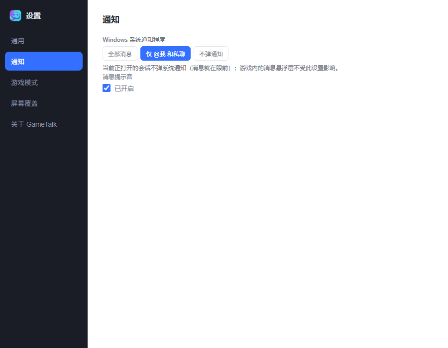
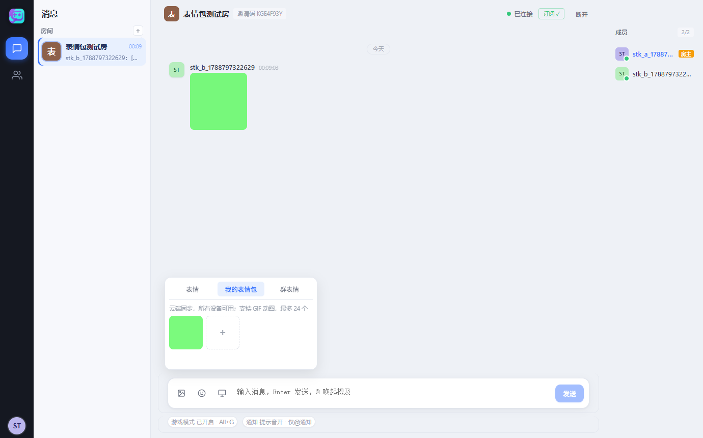

<div align="center">


# GameTalk

**为 PC 玩家打造的轻量级游戏内群组通信工具**

[](https://github.com/aocac/GameTalk/releases/latest)
[](https://github.com/aocac/GameTalk/actions/workflows/ci.yml)
[](https://github.com/aocac/GameTalk/releases/latest)
[](LICENSE)

**下载客户端** · [部署自己的服务器](#-部署一台服务器3-分钟) · [配置参考](#%EF%B8%8F-服务器配置参考) · [问题反馈](https://github.com/aocac/GameTalk/issues)

</div>

---

## 为什么做 GameTalk

玩游戏时想跟队友打字，却要 Alt+Tab 切窗口、错过团战、再切回来发现频道已经刷屏？

GameTalk 把群聊做成**游戏内的一等公民**：

> 按下全局快捷键 → 底部弹出输入框 → 输入文字回车发送 → 输入框自动关闭、焦点交还游戏
> → 队友实时收到消息 → 他们的消息以**绝对透明的悬浮层**叠加在你的游戏画面上，附带提示音。

全程双手不离键盘，视线不离游戏。退出游戏，它又是一个完整的 QQ 式聊天客户端：房间、好友、私聊、表情、图片，一样不少。

<table>
  <tr>
    <td width="50%" align="center">
      <br />
      <sub><b>房间聊天</b>：多房间预览 · 成员在线状态 · 图片消息 · @提及高亮</sub>
    </td>
    <td width="50%" align="center">
      <br />
      <sub><b>好友私聊</b>：一对一对话 · 在线状态 · 未读角标 · 编辑 / 撤回 / 引用 / 图片</sub>
    </td>
  </tr>
</table>

<details>
<summary><b>更多截图</b></summary>

<table>
  <tr>
    <td width="50%" align="center">
      <br />
      <sub><b>好友管理</b>：申请区 · 好友列表 · 单击查看资料页 · 双击私聊</sub>
    </td>
    <td width="50%" align="center">
      <br />
      <sub><b>私聊会话</b>：侧栏会话列表 · 未读角标 · 最新消息预览</sub>
    </td>
  </tr>
  <tr>
    <td width="50%" align="center">
      <br />
      <sub><b>成员右键菜单</b>：@提及 / 加好友 / 禁言档位 / 移出房间</sub>
    </td>
    <td width="50%" align="center">
      <br />
      <sub><b>通知设置</b>：Windows 系统通知三档可调 · 提示音同页管理</sub>
    </td>
  </tr>
  <tr>
    <td width="50%" align="center">
      <br />
      <sub><b>房间右键菜单</b>：复制邀请码 / 删除房间</sub>
    </td>
    <td width="50%" align="center">
      <br />
      <sub><b>个人资料</b>：头像 · 昵称 · 个性签名 · 注册时间</sub>
    </td>
  </tr>
  <tr>
    <td width="50%" align="center">
      <br />
      <sub><b>云表情包</b>：个人跨设备同步 · 群共享表情库</sub>
    </td>
  </tr>
  <tr>
    <td width="50%" align="center">
      <br />
      <sub><b>登录页</b>：注册 / 登录 / 离线试用</sub>
    </td>
    <td></td>
  </tr>
</table>

</details>

## 功能一览

### 🎮 游戏模式（Windows）

| 功能 | 说明 |
|---|---|
| 全局快捷键呼出 | 默认 `Alt+G`，支持自定义录制；改键后旧键自动失效，再按一次呼出键可收起 |
| 快捷输入框 | 底部居中弹出，自动聚焦；Enter 发送 / 点击「发送」按钮 / Esc 取消，兼容中文输入法组词 |
| 发送目标切换 | 输入框内显示当前目标（`#房间` / `@好友`），点击弹出列表随时切换，不影响主窗口 |
| 消息悬浮层 | 绝对透明背景、鼠标点击穿透；六种位置预设或拖拽自定义、滚轮缩放 50%–200%、显示时长可调 |
| 焦点恢复 | 发送后焦点自动交还游戏；建议游戏使用无边框窗口化运行 |

### 💬 群组聊天

| 功能 | 说明 |
|---|---|
| 房间制群聊 | 创建房间 → 8 位邀请码邀请好友；一次加入永久保留 |
| 成员花名册 | 在线 / 离线状态、房主标注；右键菜单：@提及 / 加好友 / 禁言（10 分钟 ~ 30 天）/ 移出房间 |
| 消息类型 | 文字 · 图片（自动压缩，灯箱查看/缩放/保存）· 表情面板 · @提及高亮与自动补全 |
| 云表情包 | 个人表情云端存储，换设备自动同步；本地旧表情自动迁移上云 |
| 群共享表情库 | 每个房间独立表情库，成员共同贡献、全群可用；贡献者标注，添加者/房主可移除 |
| 消息编辑 | 右键自己的消息即可修改，双端实时更新并显示「已编辑」 |
| 消息撤回 | 撤回者归属一目了然：自己撤「你撤回了一条消息」，房主代撤「房主撤回了 XX 的消息」 |
| 引用回复 | 气泡内引用块，跨消息定位上下文 |
| 历史与离线 | 历史向上翻页、断线秒级重连、重连后自动补齐离线消息、逐会话独立草稿 |

### 👥 好友与私聊

| 功能 | 说明 |
|---|---|
| 好友管理 | 按用户名或 `#8 位短 ID` 添加；申请 / 同意 / 拒绝 / 删除，实时事件同步 |
| 好友资料页 | 单击好友查看大头像 / ID（可复制）/ 个性签名 / 注册时间；双击直接私聊 |
| 好友私聊 | 一对一私密对话；图片、引用、编辑、撤回（仅发送者）全支持 |
| 在线状态 | 好友上下线实时推送，会话列表带在线状态点 |

### 🔔 通知与个性化

| 功能 | 说明 |
|---|---|
| Windows 系统通知 | 三档可调：全部消息 / 仅 @我 和私聊 / 不弹通知；当前正打开的会话不弹 |
| 提示音 | WebAudio 合成（零资源文件），开关与通知同页管理 |
| 个人资料 | 头像（≤3MB，服务端魔数校验）、昵称、个性签名；游戏 ID 可复制 |
| 屏幕覆盖开关 | 一键启停游戏内悬浮层，设置实时生效 |
| 网络代理 | 默认直连；需要时填写 HTTP 代理地址一键切换 |

### 🛡 服务端

| 功能 | 说明 |
|---|---|
| 传输安全 | Caddy 自动签发 HTTPS / WSS 证书；REST 全部 JWT 鉴权 |
| 滥用防护 | WS 单连接限流 + 64KB 单帧上限 + 协议层心跳清理死连接；REST 全局限流 + 登录/注册防爆破 |
| 数据安全 | PostgreSQL 16 + 纯 SQL 迁移；每日自动备份（保留 14 天）+ Windows 端异地拉取脚本 |
| 密码安全 | argon2 哈希存储；生产模式强制设置 `JWT_SECRET` |

## 📦 安装客户端

前往 [**Releases**](https://github.com/aocac/GameTalk/releases/latest) 下载对应平台安装包：

| 平台 | 格式 | 说明 |
|---|---|---|
| Windows | `-x64-setup.exe` | 推荐安装方式，内置一切依赖 |
| Linux | `.deb` / `.AppImage` | 游戏模式针对 Windows 设计，其他平台可正常使用聊天功能 |
| macOS | `.dmg` (Apple Silicon) | 同上 |

**升级无需卸载**：直接运行新安装包即可原地覆盖升级，运行中的旧版本会被自动关闭。

## 🚀 部署一台服务器（3 分钟）

任何一台装了 Docker 的 Linux 机器（VPS / 云主机）都可以：

```bash
git clone https://github.com/aocac/GameTalk
cd GameTalk/docker
bash deploy.sh        # 首次运行生成 .env，按提示填入域名后再次运行即完成
```

完成后你会得到一个 `https://你的域名` 的服务器（Caddy 自动签发 HTTPS/WSS 证书），把它填进客户端「设置 → 服务器地址」即可。和朋友们共用一台服务器，邀请码互通。

**服务构成**：

| 服务 | 说明 |
|---|---|
| `server` | GameTalk 服务端（Node 22 slim，非 root 运行，健康检查，启动自动跑迁移） |
| `postgres` | PostgreSQL 16（数据卷持久化，健康检查） |
| `caddy` | 自动 HTTPS/WSS 反向代理 |

首次部署会同时安装**每日 04:30 数据库自动备份**（systemd timer，`pg_dump` 全量 + 完整性校验 + 14 天轮转）。

## ⚙️ 服务器配置参考

所有配置通过环境变量（`docker/.env`）管理，默认值开箱即用：

| 变量 | 默认值 | 说明 |
|---|---|---|
| `JWT_SECRET` | （生产必填） | 登录令牌签名密钥；生产模式未设置或使用开发默认值将拒绝启动 |
| `JWT_EXPIRES_IN` | `7d` | 登录令牌有效期（`s` / `m` / `h` / `d` 单位） |
| `POSTGRES_PASSWORD` | （deploy.sh 生成） | 数据库密码 |
| `CORS_ORIGIN` | `*` | 允许的跨域来源，多个用逗号分隔 |
| `RATE_LIMIT_MAX` | `300` | REST 全局限流（每 IP 每分钟） |
| `RATE_LIMIT_AUTH_MAX` | `10` | 注册 / 登录限流（每 IP 每分钟，防爆破） |
| `LOG_LEVEL` | `info` | 日志级别（`debug` / `info` / `warn` / `error`） |
| `PORT` / `HOST` | `8787` / `0.0.0.0` | 非 Docker 裸跑时的监听地址 |

备份与恢复的完整操作（含恢复演练步骤、Windows 异地拉取脚本 `pull-backups-windows.ps1`）见 [部署文档](docs/deployment.md)。

## 💻 本地开发

```bash
# 服务端（开发模式：PGlite 零依赖数据库，默认 127.0.0.1:8787）
cd server && npm install && npm run dev

# 客户端（Tauri 桌面应用，需要 Rust + MSVC）
cd client && npm install && npm run tauri dev

# 测试 / 检查（两个目录各自执行）
npm test && npm run lint && npm run typecheck
```

Windows 下也可以直接双击仓库根目录的 `dev/start-local.cmd` 一键启动本地服务端。

### 项目结构

```
GameTalk/
├─ client/                  # Tauri 2 桌面客户端
│  ├─ src/                  #   React 界面（main / input / overlay / settings 四入口）
│  │  ├─ stores/            #   zustand 状态（聊天 / 认证 / 好友）
│  │  └─ app/               #   WS 客户端 / REST / 游戏模式 / 设置
│  └─ src-tauri/            #   Rust 壳（托盘 / 单实例 / 代理 / 快捷键）
├─ server/                  # Fastify 5 服务端
│  ├─ src/routes/           #   REST：认证 / 房间 / 好友 / 私聊 / 媒体
│  ├─ src/ws/               #   WebSocket 网关（广播 / 限流 / 心跳）
│  ├─ migrations/           #   纯 SQL 迁移（启动自动应用）
│  └─ test/                 #   vitest（PGlite + 真实 WS 客户端）
├─ docker/                  # Compose / Caddy / deploy.sh / 备份脚本
├─ dev/                     # 开发辅助（一键启动 / 文档截图 / E2E 回归脚本）
└─ docs/                    # 架构 / 部署 / 测试文档与界面截图
```

### 技术栈

| 层 | 选型 |
|---|---|
| 客户端 | [Tauri 2](https://v2.tauri.app/) + [React 19](https://react.dev/) + TypeScript + [zustand](https://github.com/pmndrs/zustand) |
| 服务端 | Node 22 + [Fastify 5](https://fastify.dev/) + WebSocket + `pg` |
| 数据库 | PostgreSQL 16（生产）/ [PGlite](https://github.com/electric-sql/pglite)（开发测试，同源 SQL 迁移） |
| 认证 | JWT（HS256）+ argon2 密码哈希 |
| 部署 | Docker Compose + [Caddy](https://caddyserver.com/) |
| 测试 | vitest（含真实 WebSocket 集成测试）+ ESLint + CI 四项门禁 |

## ❓ 常见问题

<details>
<summary><b>连接不上服务器？</b></summary>

核对「设置 → 服务器地址」与服务端部署地址完全一致（含端口，最常填错的就是端口）；确认服务器已启动、防火墙已放行端口。
</details>

<details>
<summary><b>游戏里看不到消息悬浮层？</b></summary>

游戏需以「无边框窗口化」运行——全屏独占模式下悬浮层会被游戏画面遮挡。悬浮层的位置、缩放、显示时长都在「设置 → 屏幕覆盖」里可调。
</details>

<details>
<summary><b>全局快捷键没有反应？</b></summary>

到「设置 → 游戏模式」重新录制一次快捷键；如果游戏以管理员身份运行，客户端也需要以管理员身份运行。
</details>

<details>
<summary><b>怎么升级到新版本？</b></summary>

直接下载新安装包运行即可原地覆盖升级，无需先卸载；运行中的旧版本会被自动关闭。聊天数据存在服务器，本机不丢任何东西。
</details>

<details>
<summary><b>我的聊天数据存在哪里？</b></summary>

全部存在你自己部署的服务器 PostgreSQL 中，客户端本机只保存登录状态。部署脚本已默认开启每日备份，建议定期做一次恢复演练（见部署文档）。
</details>

## 🗺️ 路线图

- [x] 游戏模式（快捷键 / 输入框 / 透明悬浮层 / 焦点恢复）
- [x] 多房间并行 + 未读角标
- [x] 房主管理（移出成员 / 禁言 / 删除房间）
- [x] 服务端限流与连接加固
- [x] 服务器数据库自动备份
- [x] 好友系统 + 成员在线状态
- [x] 好友私聊（DM）
- [x] @提及 / Windows 系统通知
- [x] 图片消息 / 表情
- [x] 消息编辑 / 撤回归属
- [x] QQ NT 式三栏界面 + 好友管理器
- [x] 无感升级（覆盖安装）
- [x] 云表情包 + 群共享表情库
- [ ] 消息图片对象存储备份
- [ ] 通知点击跳转到对应会话

## 🤝 参与贡献

欢迎 Issue 和 PR！提交前请确保 `npm test && npm run lint` 通过。

## 📄 许可证

[MIT](LICENSE)
