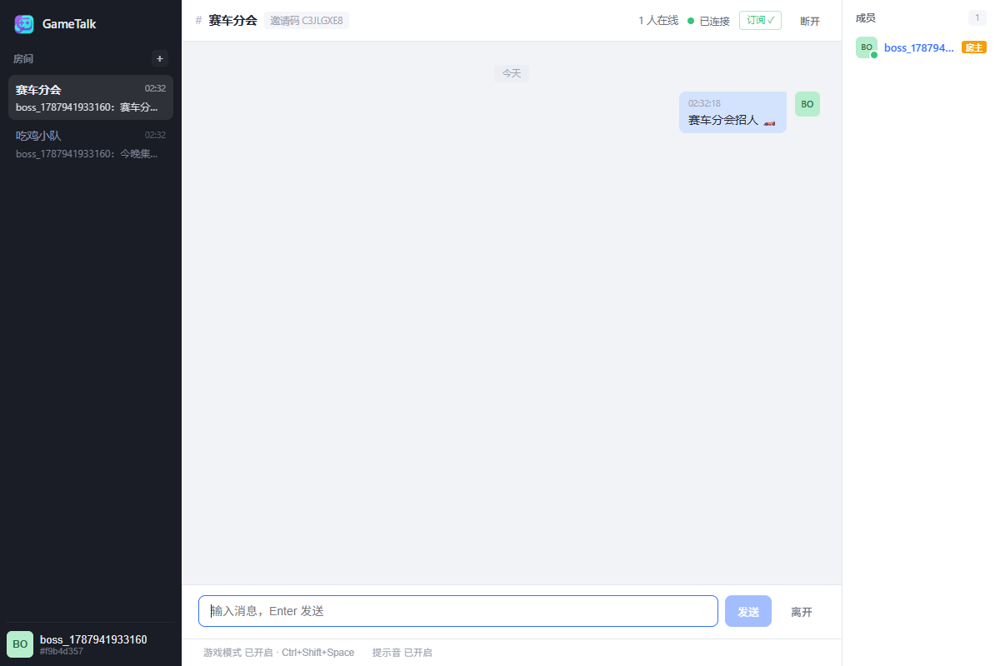
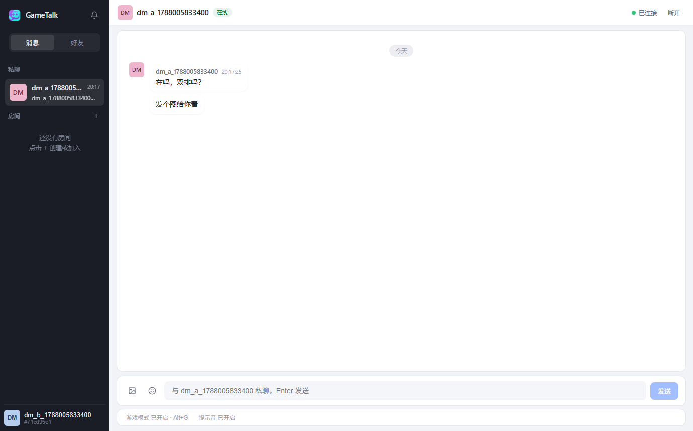
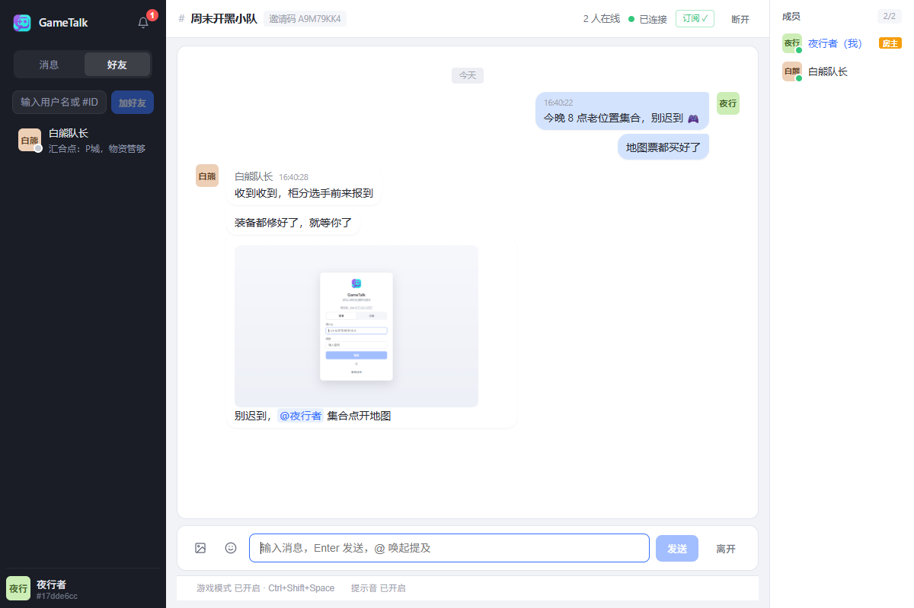
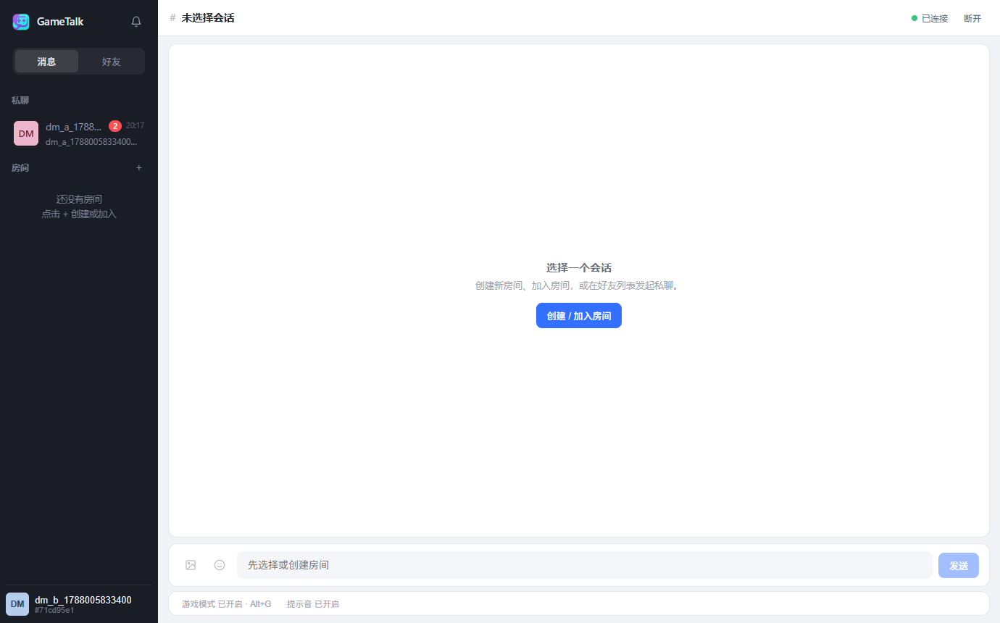
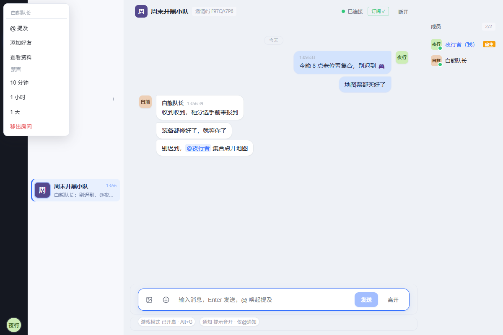
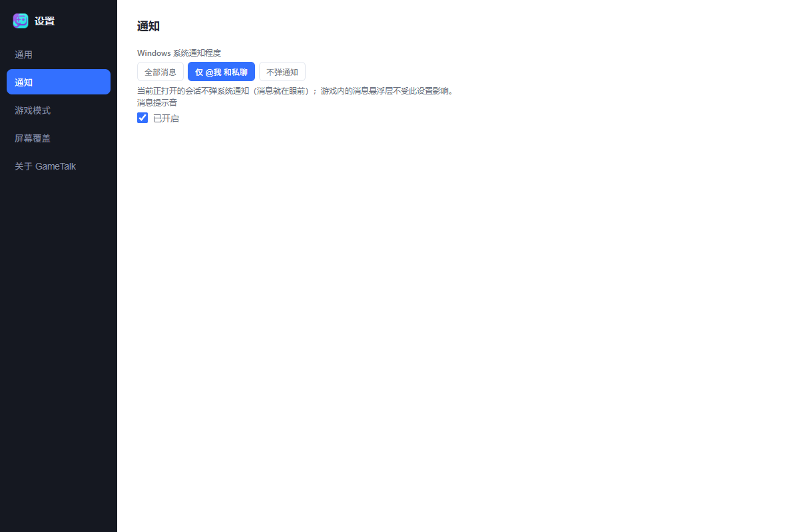
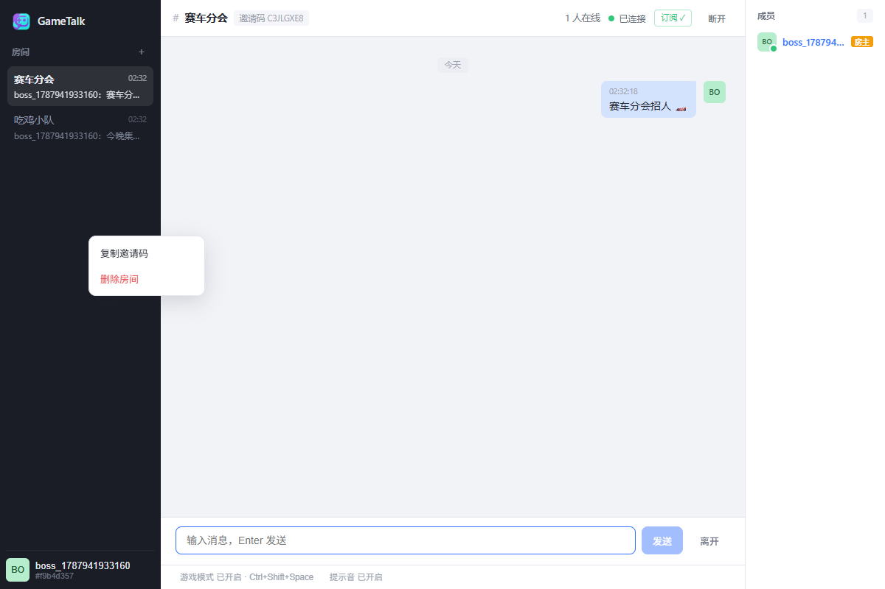
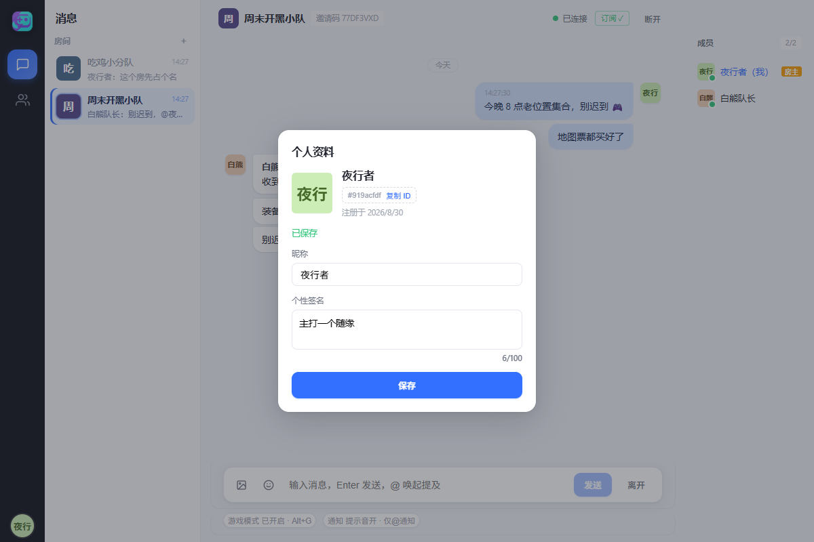
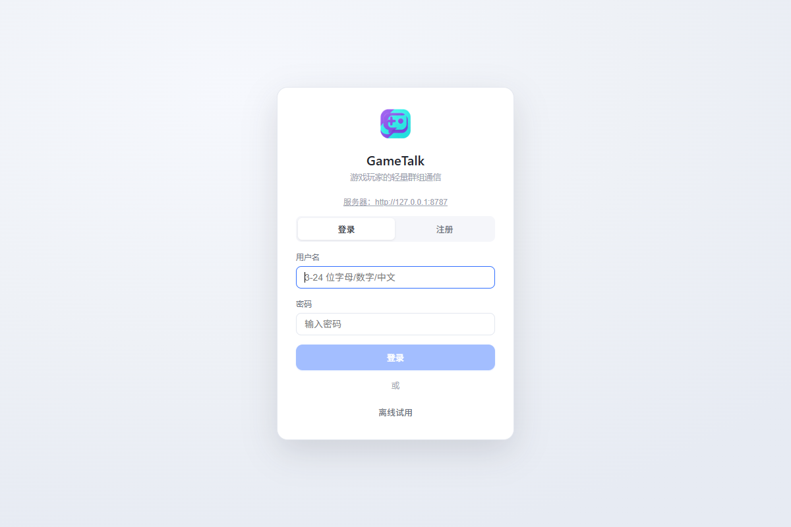

<div align="center">


# GameTalk

**为 PC 玩家打造的轻量级游戏内群组通信工具**

游戏中一键呼出 · 实时送达 · 绝对透明的消息悬浮层

[](https://github.com/aocac/GameTalk/releases/latest)
[](https://github.com/aocac/GameTalk/actions/workflows/ci.yml)
[](https://github.com/aocac/GameTalk/releases/latest)
[](LICENSE)

[下载安装包](https://github.com/aocac/GameTalk/releases/latest) · [部署自己的服务器](docs/deployment.md) · [架构文档](docs/architecture.md) · [问题反馈](https://github.com/aocac/GameTalk/issues)

</div>

---

## ✨ 它解决什么问题

玩游戏时想跟队友打字，却要 Alt+Tab 切窗口？GameTalk 把群聊做成**游戏内的一等公民**：

> 按下全局快捷键 → 底部弹出输入框 → 输入文字回车发送 → 输入框自动关闭、焦点交还游戏
> → 队友实时收到消息 → 他们的消息以**绝对透明的悬浮层**叠加在你的游戏画面上，附带提示音。

全程双手不离键盘，视线不离游戏。

<table>
  <tr>
    <td width="50%" align="center">
      <br />
      <sub><b>房间聊天</b>：多房间预览 · 成员在线状态 · 图片消息 · @提及高亮</sub>
    </td>
    <td width="50%" align="center">
      <br />
      <sub><b>好友私聊</b>：好友间一对一对话 · 在线状态 · 未读角标 · 撤回/引用/图片</sub>
    </td>
  </tr>
</table>

<details>
<summary>更多截图</summary>

<table>
  <tr>
    <td width="50%" align="center">
      <br />
      <sub><b>好友面板</b>：按用户名 / #ID 添加 · 在线状态 · 一键发起私聊</sub>
    </td>
    <td width="50%" align="center">
      <br />
      <sub><b>私聊会话</b>：侧栏会话列表 · 未读角标 · 最新消息预览</sub>
    </td>
  </tr>
  <tr>
    <td width="50%" align="center">
      <br />
      <sub><b>成员右键菜单</b>：@提及 / 加好友 / 房主禁言与移出</sub>
    </td>
    <td width="50%" align="center">
      <br />
      <sub><b>通知中心</b>：@提及 / 好友事件聚合，一键跳转</sub>
    </td>
  </tr>
  <tr>
    <td width="50%" align="center">
      <br />
      <sub><b>房间右键菜单</b>：复制邀请码 / 删除房间</sub>
    </td>
    <td width="50%" align="center">
      <br />
      <sub><b>个人资料</b>：头像 · 昵称 · 个性签名 · 注册时间</sub>
    </td>
  </tr>
  <tr>
    <td width="50%" align="center">
      <br />
      <sub><b>登录页</b>：注册 / 登录 / 离线试用</sub>
    </td>
    <td></td>
  </tr>
</table>

</details>

## 🎮 核心特性

**游戏模式**
- 全局快捷键呼出输入框（可自定义录制，改键后旧键自动失效）
- Enter 发送 / Esc 取消（兼容中文输入法组词）
- 消息悬浮层：绝对透明背景、点击穿透、六种位置预设、可拖拽自定义、滚轮缩放
- 发送后自动恢复游戏焦点（建议游戏使用无边框窗口化）

**群组通信**
- 房间制：创建房间 → 8 位邀请码邀请好友 → 实时群聊；一次加入永久保留（QQ 群式）
- 成员花名册：在线/离线状态（离线灰头像）、房主标注、点击查看资料卡片、右键菜单（@提及 / 加好友 / 房主禁言与移出）
- 好友系统：按用户名或 #ID 添加好友，在线状态实时同步，与房间分开管理
- 好友私聊：一对一私密对话，侧栏会话列表 + 未读角标，支持图片 / 引用回复 / 撤回；删除好友即隐藏会话
- 消息富文本：图片消息（自动压缩、点击灯箱查看）、表情面板、@提及高亮与自动补全
- 消息可靠：乐观发送即时上屏、断线秒级重连、重连后自动补齐离线消息、历史消息向上翻页
- 多房间并行：同时接收所有房间消息，未读角标 + @我 角标 + 最新消息预览实时更新

**通知与账号**
- 通知中心：@提及、好友申请等事件聚合，一键跳转对应房间或好友页
- 注册 / 登录 / 头像（≤3MB，服务端魔数校验）/ 昵称 / 个性签名
- 个人资料独立入口：头像菜单一键直达，游戏 ID 可复制
- 消息提示音（WebAudio 合成，零资源文件）、离线试用模式
- 网络代理设置（默认直连，需要时一键切换）

**服务端加固**
- WS：单连接限流、64KB 单帧上限、协议层心跳自动清理死连接
- REST：全局限流 + 登录/注册防爆破限流
- 数据：PostgreSQL + 纯 SQL 迁移，启动自动建表

## 📦 安装

前往 [**Releases**](https://github.com/aocac/GameTalk/releases/latest) 下载对应平台安装包：

| 平台 | 格式 | 说明 |
|---|---|---|
| Windows | `-x64-setup.exe` | 推荐安装方式，内置一切依赖 |
| Linux | `.deb` / `.AppImage` | 游戏模式针对 Windows 设计，Linux/macOS 包未经专项验收 |
| macOS | `.dmg` (Apple Silicon) | 同上 |

安装后在「设置 → 服务器地址」填入服务器地址（见下节），注册账号即可开黑。

## 🚀 部署一台服务器（3 分钟）

任何一台装了 Docker 的 Linux 机器（VPS / 云主机）都可以：

```bash
git clone https://github.com/aocac/GameTalk
cd GameTalk/docker
bash deploy.sh        # 首次运行生成 .env，按提示填入域名后再次运行即完成
```

完成后你会得到一个 `https://你的域名` 的服务器（Caddy 自动签发 HTTPS/WSS 证书），
把它填进客户端「设置 → 服务器地址」即可。和朋友们共用一台服务器，邀请码互通。

部署脚本会顺手装好**每日数据库自动备份**（systemd 定时，保留 14 天），恢复方法见
[部署文档](docs/deployment.md)。已有自己的域名和 VPS？完整指引同样见部署文档。

## 🖥️ 本地开发

```bash
# 服务端（开发模式：PGlite 零依赖数据库，默认 127.0.0.1:8787）
cd server && npm install && npm run dev

# 客户端（Tauri 桌面应用，需要 Rust + MSVC）
cd client && npm install && npm run tauri dev

# 测试 / 检查（两个目录各自执行）
npm test && npm run lint && npm run typecheck
```

Windows 下也可以直接双击仓库根目录的 `dev/start-local.cmd` 一键启动本地服务端。

## 🏗️ 技术架构

```
客户端（Tauri 2 三窗口）                    服务端（Node 22 + Fastify 5）
├─ main    聊天主界面        ──REST(JWT)──►  REST 路由（认证 / 房间 / 头像）
├─ input   游戏内输入框      ──WS(JWT)────►  WS 网关（房间广播 / 限流 / 心跳）
└─ overlay 消息悬浮层        ◄─实时推送────  PostgreSQL 16（消息 / 房间 / 用户）
```

- **客户端**：Tauri 2 + React 19 + TypeScript + zustand；Rust 侧仅保留托盘 / 单实例等系统能力
- **服务端**：Fastify 5 + WebSocket + `pg`；开发测试用 PGlite（与生产同源 SQL 迁移）
- **部署**：Docker Compose + Caddy（自动 HTTPS/WSS）+ 每日数据库备份
- **测试**：server 42 + client 13 vitest 用例（含真实 WebSocket 集成测试）、ESLint、CI 全绿门禁

更多细节见 [架构文档](docs/architecture.md) 与 [测试文档](docs/testing.md)。

## ❓ 常见问题

**连接不上服务器？**
核对「设置 → 服务器地址」与服务端部署地址完全一致（含端口，最常填错的就是端口）；确认服务器已启动、防火墙已放行。

**游戏里看不到消息悬浮层？**
游戏需以「无边框窗口化」运行——全屏独占模式下悬浮层会被游戏画面遮挡。悬浮层的位置、缩放、显示时长都在设置里可调。

**全局快捷键没有反应？**
到「设置 → 游戏模式」重新录制一次快捷键；如果游戏以管理员身份运行，客户端也需要以管理员身份运行。

**我的聊天数据存在哪里？**
全部存在你自己部署的服务器 PostgreSQL 中，客户端本机只保存登录状态。部署脚本已默认开启每日备份，也建议定期做一次恢复演练（见部署文档）。

## 🗺️ 路线图

- [x] 游戏模式（快捷键 / 输入框 / 透明悬浮层 / 焦点恢复）
- [x] 多房间并行 + 未读角标
- [x] 房主管理（移出成员 / 禁言 / 删除房间）
- [x] 服务端限流与连接加固
- [x] 服务器数据库自动备份
- [x] 好友系统 + 成员在线状态
- [x] 好友私聊（DM）
- [x] @提及 / 通知中心
- [x] 图片消息 / 表情
- [ ] 消息编辑

## 🤝 参与贡献

欢迎 Issue 和 PR！提交前请确保 `npm test && npm run lint` 通过。

## 📄 许可证

[MIT](LICENSE)
